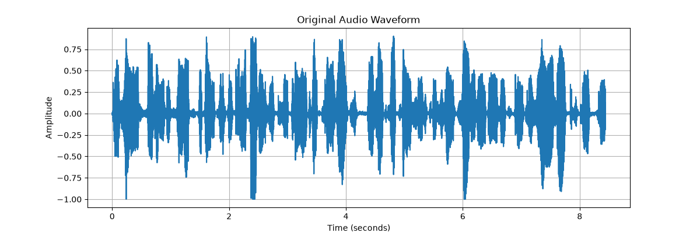
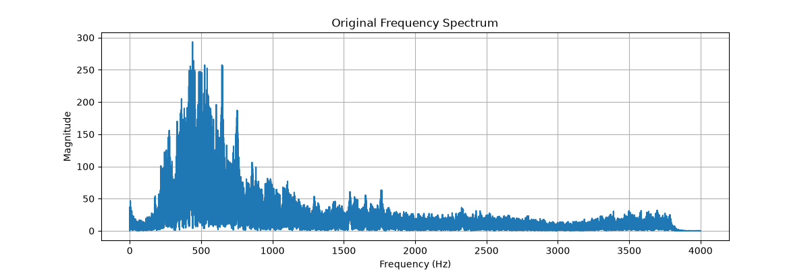
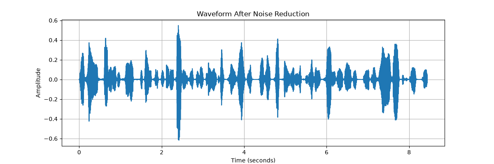
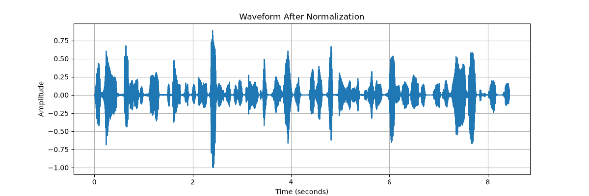
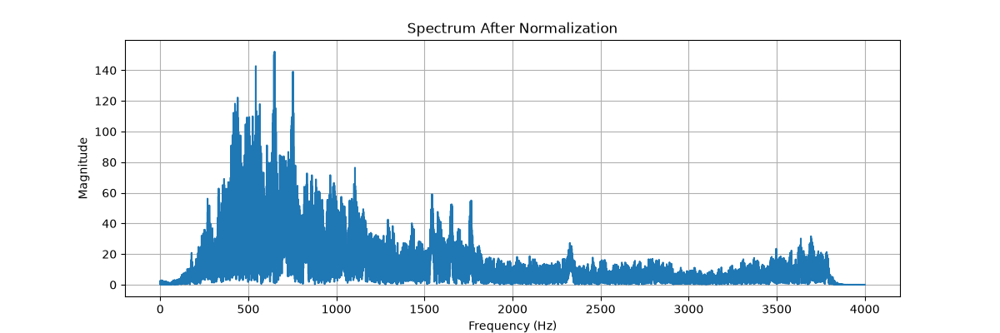
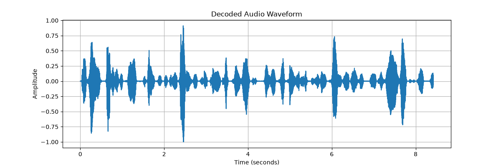
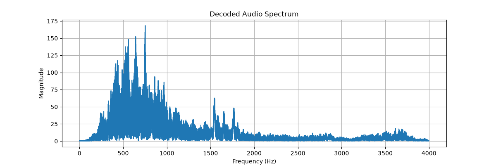

# Phase 1 - Audio Processing using Python and Codec2

## Project Overview

This project demonstrates a complete Digital Signal Processing (DSP) workflow on a WAV audio file. The objective is to analyze the audio, remove the DC offset, reduce background noise, normalize the signal, encode it using Codec2, decode it back to WAV format, and evaluate the results.

---

# Objectives

The objectives of this project are:

- Read and analyze a WAV audio file.
- Display important audio metadata.
- Remove the DC offset.
- Reduce background noise.
- Normalize the processed audio.
- Encode the processed audio using Codec2.
- Decode the Codec2 bitstream back to WAV.
- Compare the processed and decoded audio.
- Generate waveform and frequency spectrum plots.

---

# Technologies Used

- Python 3.x
- NumPy
- SoundFile
- Matplotlib
- NoiseReduce
- Codec2
- WSL (Ubuntu)

---

# Audio Processing Pipeline

```
Input Audio
      │
      ▼
Read WAV File
      │
      ▼
Audio Analysis
      │
      ▼
Remove DC Offset
      │
      ▼
Noise Reduction
      │
      ▼
Normalization
      │
      ▼
Codec2 Encoding
      │
      ▼
Codec2 Decoding
      │
      ▼
Evaluation
```

---

# Processing Steps

## 1. Audio Analysis

The script reads the WAV file and extracts:

- Sample Rate
- Number of Channels
- Audio Duration
- Data Type
- Bit Depth

This information provides an overview of the audio before processing.

---

## 2. DC Offset Removal

The DC offset is calculated as the mean of all audio samples.

The offset is removed by subtracting the mean value from every sample.

After removal, the new DC offset becomes approximately zero, confirming that the waveform is centered.

---

## 3. Noise Reduction

Background noise is reduced using the **NoiseReduce** library.

The algorithm performs spectral noise suppression, reducing unwanted noise while preserving the speech signal.

---

## 4. Audio Normalization

The processed audio is normalized by dividing every sample by the maximum absolute amplitude.

Normalization increases the loudness while preventing clipping.

---

## 5. Codec2 Encoding

The normalized audio is converted into RAW PCM format and encoded using Codec2 in **3200 bps** mode.

Codec2 compresses speech efficiently for low-bandwidth communication systems.

---

## 6. Codec2 Decoding

The encoded Codec2 file is decoded back into RAW audio and converted into a WAV file.

The decoded audio is compared with the processed audio to evaluate Codec2 performance.

---

# Generated Files

The script produces:

### Audio Files

- audio_no_dc.wav
- audio_noise_reduced.wav
- audio_normalized.wav
- audio.codec2
- audio_decoded.wav

### Graphs

- original_waveform.png
- original_spectrum.png
- noise_reduced_waveform.png
- noise_reduced_spectrum.png
- normalized_waveform.png
- normalized_spectrum.png
- decoded_waveform.png
- decoded_spectrum.png

---

# Graph Explanation

## Waveform

The waveform displays audio amplitude over time.

It helps visualize:

- DC offset
- Signal amplitude
- Changes after processing

---

## Frequency Spectrum

The frequency spectrum is generated using the Fast Fourier Transform (FFT).

It shows the frequency components of the signal and helps visualize how processing affects the spectral content.

---

# Evaluation

The following observations were made:

- The DC offset was successfully removed.
- Background noise was reduced.
- The normalized audio had consistent amplitude.
- Codec2 successfully encoded and decoded the processed audio.
- The decoded audio sounded very similar to the normalized audio, indicating that Codec2 preserved speech quality while compressing the signal.

# Signal-to-Noise Ratio (SNR)

The Signal-to-Noise Ratio (SNR) was calculated to quantitatively evaluate the quality of the processed audio.

SNR compares the power of the useful speech signal with the power of the remaining noise.

A higher SNR value indicates better audio quality and more effective noise reduction.

**Calculated SNR:** XX.XX dB

---

# Prerequisites

Before running the project, install:

- Python 3.x
- Git
- WSL (Ubuntu)
- Codec2

Create and activate a virtual environment.

Install the required Python libraries.

---

# Installation

Clone the repository:

```bash
git clone <repository-url>
cd R-D-Interns
```

Create a virtual environment:

```bash
python3 -m venv .venv
```

Activate it:

```bash
source .venv/bin/activate
```

Install dependencies:

```bash
pip install -r requirements.txt
```

Install Codec2 (Ubuntu):

```bash
sudo apt update
sudo apt install codec2
```

---

# Run the Project

```bash
python audio_processing.py
```

---

# Output

All processed audio files and graphs are saved inside the **output/** directory.

---

# Learning Outcomes

Through this project, I learned:

- Reading WAV files in Python.
- Audio metadata analysis.
- Digital Signal Processing fundamentals.
- DC offset removal.
- Noise suppression techniques.
- Audio normalization.
- Fast Fourier Transform (FFT).
- Codec2 speech compression.
- Audio encoding and decoding.
- Audio evaluation using waveform and spectrum analysis.
## Output Graphs

### Original Waveform



### Original Spectrum



### Noise Reduced Waveform



### Noise Reduced Spectrum


### Normalized Waveform



### Normalized Spectrum



### Decoded Waveform



### Decoded Spectrum

